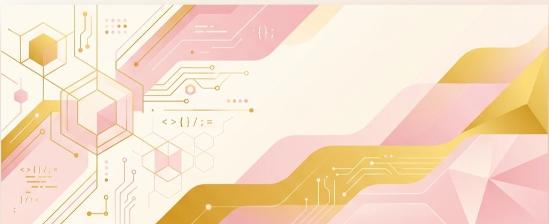

<!-- ===================================== -->
<!--            PINK GITHUB README         -->
<!-- ===================================== -->

  <!-- Cropped, high-quality, modern custom banner -->
  

 

  

---

# 🌸 Про мене

Привіт! Мене звати **Ольга** 👋  
Я студентка комп'ютерних наук (Computer Science) та Full Stack / Mobile розробниця з України 🇺🇦. Захоплююсь створенням естетичних, зручних та функціональних цифрових продуктів з чистою архітектурою та продуманим UI/UX.

### ✨ Ключові досягнення та фокус:
* 📱 **Mobile Development**: Проектування та розробка кросплатформних мобільних додатків на **React Native** (**TypeScript** / **Expo**).
* 💻 **SaaS & CRM рішення**: Співзасновниця та Lead Developer кросплатформного програмного забезпечення для б'юті-салонів (**[BeautyRoomApp](https://github.com/oljyaaa/BeautyRoomApp)**) — автоматизованого журналу записів та обліку клієнтів.
* 🐍 **Backend Engineering**: Розробка надійної серверної логіки на **Python** та **PHP**, інтеграція REST APIs та оптимізація баз даних **MySQL**.
* 🎨 **UI/UX Design**: Проектування інтерфейсів у **Figma** з акцентом на сучасні тренди та користувацький досвід (UX).
* 🧪 **QA Testing**: Написання тестів та забезпечення високої якості та стабільності коду перед релізом.

---

# 💻 Технологічний стек

  

---

# 📊 Статистика GitHub

  <table border="0" cellpadding="5" cellspacing="5">
    <tr>
      <td valign="top" width="50%">
        <!-- Статистика профілю через стабільне дзеркало extended -->
        
      </td>
      <td valign="top" width="50%">
        <!-- Найбільш використовувані мови через дзеркало extended -->
        
      </td>
    </tr>
  </table>

 

  <!-- GitHub Streak Stats -->
  

 

  <!-- GitHub Activity Graph -->
  

---

# 🏆 Досягнення (Trophies)

  

---

# 🐍 Змійка активності (GitHub Contribution Snake)

  <picture>
    <source media="(prefers-color-scheme: dark)" srcset="https://raw.githubusercontent.com/oljyaaa/oljyaaa/output/github-contribution-grid-snake-dark.svg">
    
  </picture>

---

# ⭐ Обрані проекти

  <!-- Справжній лінк на кросплатформний мобільний додаток -->
  
  <!-- Справжній лінк на чат-бот -->
  

---

# 🌱 Що я зараз вивчаю

  
  
  
  
  

---

# 📫 Як зі мною зв'язатися

  
  
  

---

# 💖 Відвідуваність

  

---

  <em>"Code. Coffee. Create. Repeat."</em> ☕

 

  

