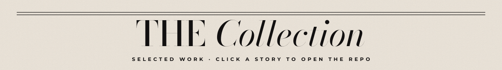
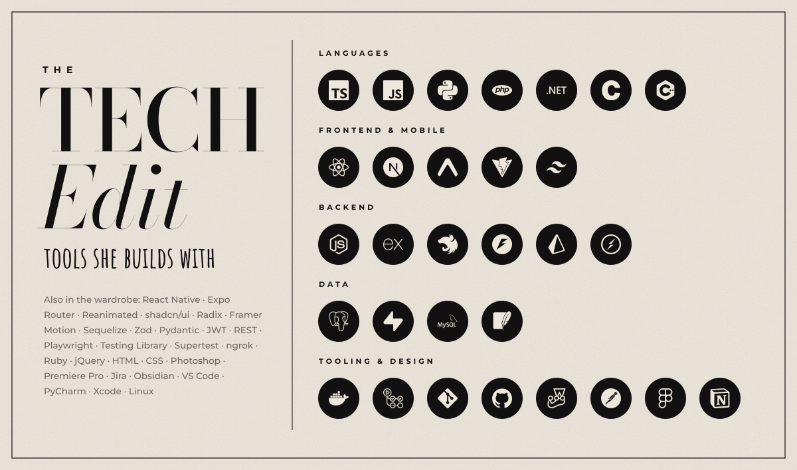
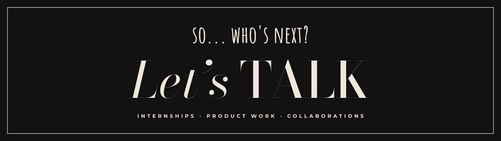
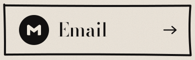
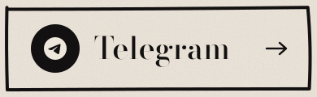
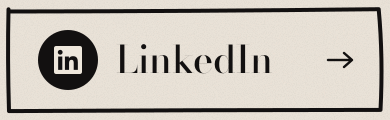
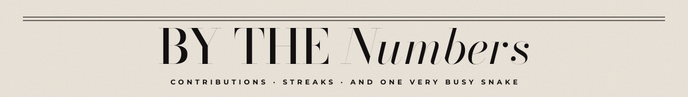
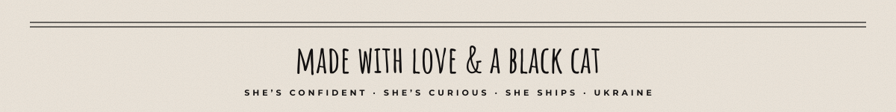

Also in the archive: <a href="https://github.com/oljyaaa/wishlist-api"><b>Wishlist API</b></a> · <a href="https://github.com/oljyaaa/milky-petal-salon"><b>Milky Petal Salon</b></a> · <a href="https://github.com/oljyaaa/LogiTalk"><b>LogiTalk</b></a> · <a href="https://github.com/oljyaaa/OOP_practice"><b>OOP practice</b></a>

 
 

 
 

<picture>
  <source media="(prefers-color-scheme: dark)" srcset="https://raw.githubusercontent.com/oljyaaa/oljyaaa/output/github-contribution-grid-snake-dark.svg" />
  <source media="(prefers-color-scheme: light)" srcset="https://raw.githubusercontent.com/oljyaaa/oljyaaa/output/github-contribution-grid-snake.svg" />
  
</picture>

