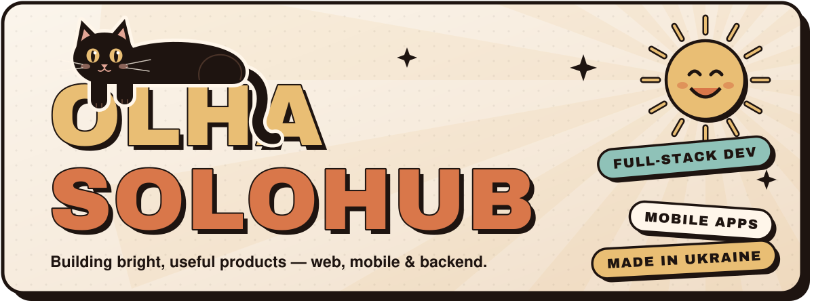
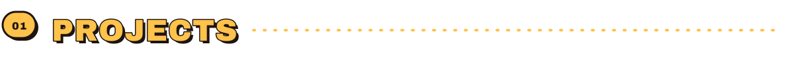
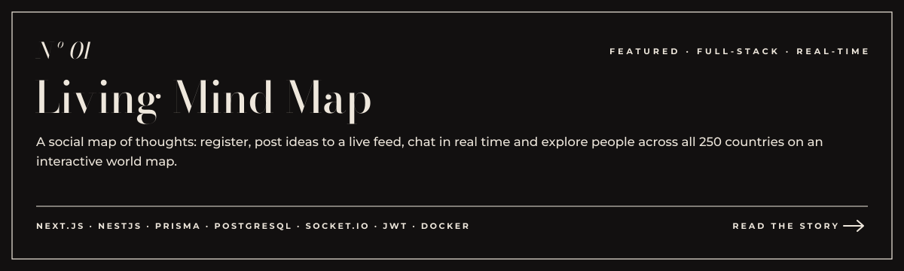
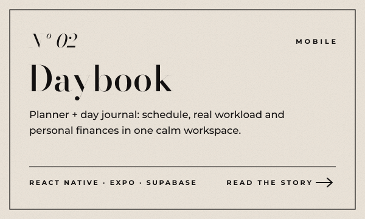
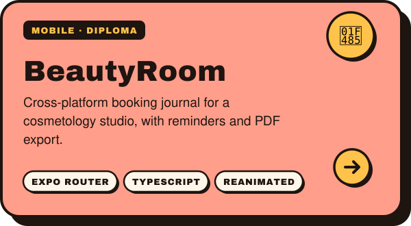
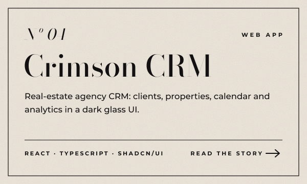
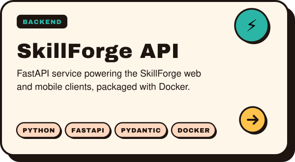
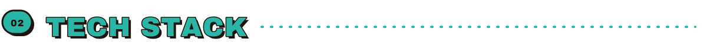
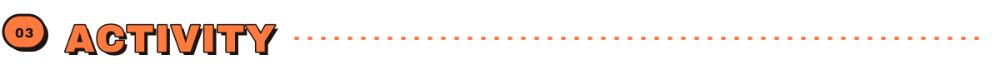

  
   
   
  
   
   
  
  
  

 

  <b>Open to internships &amp; product work.</b> 
  I’m a CS student who ships complete products — from the Figma frame to the database — and I genuinely enjoy the problem-solving in between.

 

  
  

  
  

Also: <a href="https://github.com/oljyaaa/wishlist-api"><b>Wishlist API</b></a> (Express · Sequelize · MySQL · Zod · Jest) · <a href="https://github.com/oljyaaa/milky-petal-salon"><b>Milky Petal Salon</b></a> (React · Vite) · <a href="https://github.com/oljyaaa/LogiTalk"><b>LogiTalk</b></a> (Python chat bot) · <a href="https://github.com/oljyaaa/OOP_practice"><b>OOP practice</b></a> (C#)

 
 

  <b>🧩 Languages</b> 
  

  <b>📱 Frontend & mobile</b> 
   + React Native · Expo · Expo Router · Reanimated · shadcn/ui · Radix · Framer Motion

  <b>⚙️ Backend</b> 
   + REST APIs · Socket.IO · JWT · Zod · Pydantic

  <b>🗄️ Data</b> 
  

  <b>🚀 DevOps & testing</b> 
   + Playwright · Testing Library · Supertest · ngrok

  <b>🎨 Design & workflow</b> 
   + Jira

  <b>💻 IDEs & platforms</b> 
   + Xcode

 

  

  <picture>
    <source media="(prefers-color-scheme: dark)" srcset="https://raw.githubusercontent.com/oljyaaa/oljyaaa/output/github-contribution-grid-snake-dark.svg" />
    <source media="(prefers-color-scheme: light)" srcset="https://raw.githubusercontent.com/oljyaaa/oljyaaa/output/github-contribution-grid-snake.svg" />
    
  </picture>

 

  <b>☀️ Stay curious, ship kindly.</b> 
  Made in Ukraine 🇺🇦 · with a cat nearby

